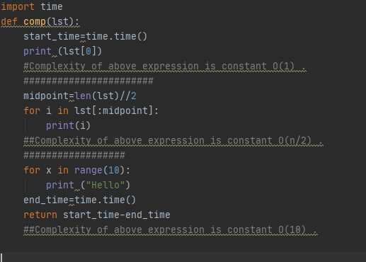

# Algorithm Analysis

Algorithm analysis is concerned with comparing algorithms based upon the amount of computing resources that each algorithm uses. We want to be able to consider two algorithms and say that one is better than the other because it is more efficient in its use of those resources or perhaps because it simply uses fewer.

At this point, it is important to think more about what we really mean by computing resources. There are two different ways to look at this. One way is to consider the amount of space or memory an algorithm requires to solve the problem. The amount of space required by a problem solution is typically dictated by the problem instance itself. Every so often, however, there are algorithms that have very specific space requirements, and in those cases we will be very careful to explain the variations.

We can analyze and compare algorithms based on the amount of time they require to execute. This measure is sometimes referred to as the “execution time” or “running time” of the algorithm. 

One way we can measure the execution time for the function is to do a ```benchmark analysis```. This means that we will track the actual time required for the program to compute its result. In Python, we can benchmark a function by noting the starting time and ending time with respect to the system we are using. In the ```time``` module there is a function called ```time``` that will return the current system clock time in seconds since some arbitrary starting point. By calling this function twice, at the beginning and at the end, and then computing the difference, we can get an exact number of seconds (fractions in most cases) for execution.

The benchmark technique computes the actual time to execute. It does not really provide us with a useful measurement, because it is dependent on a particular machine, program, time of day, compiler, and programming language. Instead, we would like to have a characterization that is independent of the program or computer being used. This measure would then be useful for judging the algorithm alone and could be used to compare algorithms across implementations.



# Big-O Notation

When trying to characterize an algorithm’s efficiency in terms of execution time, independent of any particular program or computer, it is important to quantify the number of operations or steps that the algorithm will require. If each of these steps is considered to be a basic unit of computation, then the execution time for an algorithm can be expressed as the number of steps required to solve the problem. Deciding on an appropriate basic unit of computation can be a complicated problem and will depend on how the algorithm is implemented.

The order of magnitude function describes the part of ```T(n)``` that increases the fastest as the value of ```n``` increases. Order of magnitude is often called ```Big-O``` notation (for “order”) and written as ```O(f(n))```. It provides a useful approximation to the actual number of steps in the computation. The function ```f(n)``` provides a simple representation of the dominant part of the original ```T(n)```.

As another example, suppose that for some algorithm, the exact number of steps is ```T(n)=5n^2+27n+1005```. When n is small, say 1 or 2, the constant 1005 seems to be the dominant part of the function. However, as ```n``` gets larger, the ```n^2``` term becomes the most important. In fact, when n is really large, the other two terms become insignificant in the role that they play in determining the final result. Again, to approximate ```T(n)``` as ```n``` gets large, we can ignore the other terms and focus on ```5n^2```. In addition, the coefficient 5 becomes insignificant as ```n``` gets large. We would say then that the function ```T(n)``` has an order of magnitude ```f(n)=n^2```, or simply that it is ```O(n2)```.