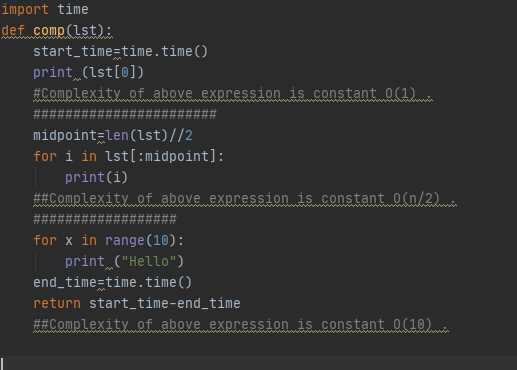

# Algorithm Analysis

Algorithm analysis is concerned with comparing algorithms based upon the amount of computing resources that each algorithm uses. We want to be able to consider two algorithms and say that one is better than the other because it is more efficient in its use of those resources or perhaps because it simply uses fewer.

At this point, it is important to think more about what we really mean by computing resources. There are two different ways to look at this. One way is to consider the amount of space or memory an algorithm requires to solve the problem. The amount of space required by a problem solution is typically dictated by the problem instance itself. Every so often, however, there are algorithms that have very specific space requirements, and in those cases we will be very careful to explain the variations.

We can analyze and compare algorithms based on the amount of time they require to execute. This measure is sometimes referred to as the “execution time” or “running time” of the algorithm. 

One way we can measure the execution time for the function is to do a benchmark analysis. This means that we will track the actual time required for the program to compute its result. In Python, we can benchmark a function by noting the starting time and ending time with respect to the system we are using. In the ```time``` module there is a function called ```time``` that will return the current system clock time in seconds since some arbitrary starting point. By calling this function twice, at the beginning and at the end, and then computing the difference, we can get an exact number of seconds (fractions in most cases) for execution.

