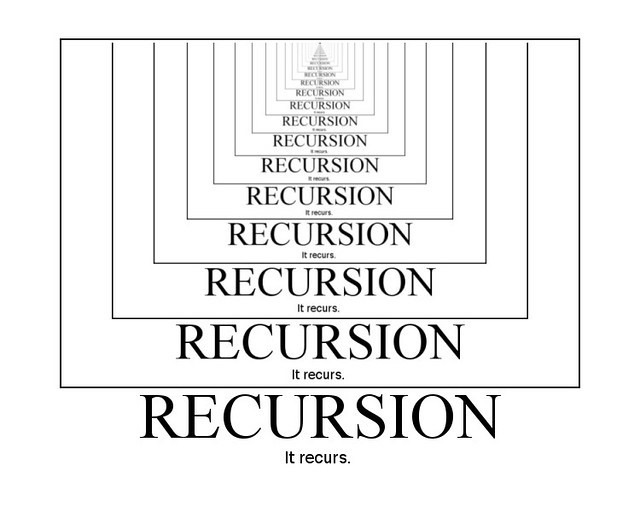

# Data Structures

This is a repository of abstract data structures written in Python.
This repo covers the essential information that every serious programmer needs to know about algorithms and 
data structures, thus provides the basic requirements to understand and implement 
these data structures using **python3** language.

The inspiration for this repo was acquired through the Udemy .

- [Array](https://github.com/KUMAWAT55/Data-Structure/tree/master/Array)

An array is collection of items stored at contiguous memory locations.
This module defines an object type which can compactly represent an array of basic values: characters, integers, floating point numbers
  
- [BigO_Comparision](https://github.com/KUMAWAT55/Data-Structure/tree/master/BigO_Comparision)

  
- [Hackerrank](https://github.com/KUMAWAT55/Data-Structure/tree/master/Hackerrank)

  
- [LinkedList](https://github.com/KUMAWAT55/Data-Structure/tree/master/LinkedList)

  
- [Recursion](https://github.com/KUMAWAT55/Data-Structure/tree/master/Recursion)  

  

- [Stack&Queue](https://github.com/KUMAWAT55/Data-Structure/tree/master/Stack&Queue)

  
- [Trees](https://github.com/KUMAWAT55/Data-Structure/tree/master/Trees)

The tree data structure has a root branches and leaves.
So just like a tree in nature you have a similar structure.
The difference between a tree in nature and a tree computer science 
though is that a tree data structure
has its root at the top and its leaves at the bottom so it branches downwards.

  
  