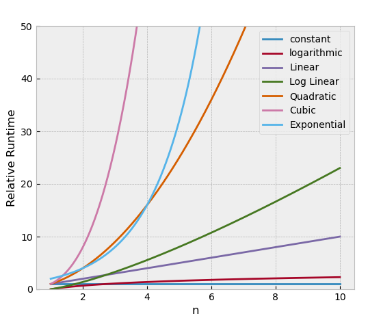

# Data Structures

This is a repository of abstract data structures written in Python.
This repo covers the essential information that every serious programmer needs to know about algorithms and 
data structures, thus provides the basic requirements to understand and implement 
these data structures using python3 language.

The inspiration for this repo was acquired through the Udemy .

- [Array](https://github.com/KUMAWAT55/Data-Structure/tree/master/Array)

  
- [BigO_Comparision](https://github.com/KUMAWAT55/Data-Structure/tree/master/BigO_Comparision)

  
- [Hackerrank](https://github.com/KUMAWAT55/Data-Structure/tree/master/Hackerrank)

  

- [Stack&Queue](https://github.com/KUMAWAT55/Data-Structure/tree/master/Stack&Queue)

  